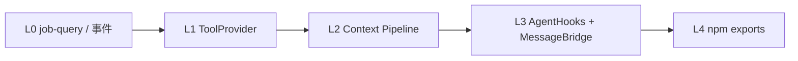
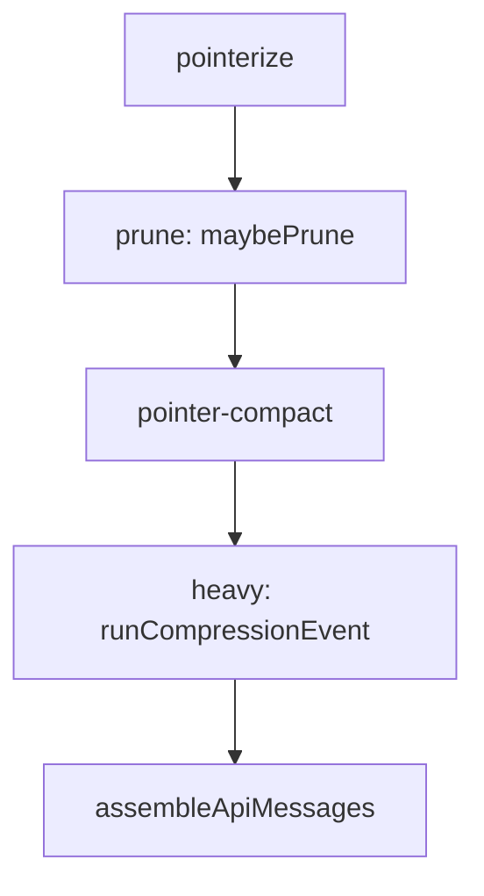

# minimal-agent-ts 统一路线图

> **版本**: 2026-07-14（§6 Inbound/Schedule 契约）  
> **定位**: TypeScript **Agent harness**（由上下文事件结构实验演进）；产品迭代、底座接缝、压测与扩展的**规划源**。  
> **原则**: 可交付小步；对外叙事与 [README.md](../README.md) 对齐，不依赖对比其他 Agent 产品。  
> **验证**: 本文件方向 + `npm test` / `npm run typecheck`。

---

## 1. 文档索引

| 文档 | 职责 |
|------|------|
| [README.md](../README.md) | **对外入口**：定位、特性、上手 |
| [QUICKSTART.md](../QUICKSTART.md) | 安装与常用命令 |
| [DEPS.md](./DEPS.md) | 宿主 / npm 依赖分层 |
| [ROADMAP.md](../ROADMAP.md) | 根目录轨 A–G 缩写与历史记录 |
| [SPEC_CONTEXT_MANAGEMENT.md](../SPEC_CONTEXT_MANAGEMENT.md) | 上下文 / 指针化（**v2.0** 对齐 L2 pipeline；非 Zvec） |
| [EVAL_LITM.md](./EVAL_LITM.md) | **长程 / Lost in the Middle 实验纲要**：解法地图、控制变量、指标、任务族、分期 |
| [SPEC_LLM_ROUTER.md](../SPEC_LLM_ROUTER.md) | api_profiles、fallback、reasoning |
| [SPEC_TOOLS.md](../SPEC_TOOLS.md) | 工具（含 Office ✅） |
| [SPEC_WORKFLOW.md](../SPEC_WORKFLOW.md) | 多角色编排：profile 共用 spawn、flow/DAG、job 节点（**W1–W3 ✅**） |
| [SPEC_JOB_SESSION_NOTIFY.md](../SPEC_JOB_SESSION_NOTIFY.md) | Job/workflow 完成 → MessageBridge notice + session 入队续跑（**Draft**） |
| [SPEC_SESSION_AUTO_RUN.md](../SPEC_SESSION_AUTO_RUN.md) | auto_run / SystemEventHub **二次开发占位**（定时/Inbound 扩展约定） |
| [SPEC_SESSION_WORKSPACE.md](../SPEC_SESSION_WORKSPACE.md) | Session 分桶 / 同会话切目录 / 路径授权与权限继承（**设计**） |
| [SPEC_VISION.md](../SPEC_VISION.md) | Vision / 多模态 user 图片消息管线（**设计**） |
| [SPEC_TUI.md](../SPEC_TUI.md) | TUI 规范 |
| [SPEC_WEB_UI.md](../SPEC_WEB_UI.md) | 浏览器第二 UI：HTTP/WS + MessageBridge sink + 本地 token（**W0/W1**） |
| [agent.mcp.example.json](../agent.mcp.example.json) | MCP 配置示例 |

**维护约定**: 新里程碑写入本文；子 SPEC 写接口/验收；根 `ROADMAP.md` 只追加版本行。

---

## 2. 当前状态快照（2026-07-14）

### 2.1 已完成（核心底座）

| 能力 | 说明 |
|------|------|
| 上下文 | session、TaskSummary、冷存、pointerize、prune、recall |
| 主循环 | 并行 tool、流式、loop guard、MCP/Skills、workflow |
| Spawn | `spawn_agent`、`spawn_background`、`code_review`、shell_policy |
| TUI | 终端 UI、会话备注/删除、`/lang`、MINIMAL banner、底栏 token/cache |
| 工具 | git_*、lsp、office_read/write、test_run、web_search/fetch |
| LLM | `api_profiles`、fallback、reasoning、隐式 cache 遥测 |
| MCP | stdio + **streamable-http** + legacy **sse**（`mcp-transport.ts`） |
| 权限 | `PermissionGate` JIT、`/approve`、`workflow` checkpoint |
| 交接 | `/brief`（原 `/handoff` 别名已移除） |

### 2.2 仍欠项（按优先级）

| 优先级 | 轨 | 内容 |
|:------:|-----|------|
| **P0 产品** | 产品 | ~~TUI `/jobs`、job-query~~ ✅；~~`web_search` v1+v1.5~~ ✅ |
| **P1 产品** | 产品 | ~~`/spawns` 实装、TUI `turn_io`~~ ✅；pi overlay 统一（按需） |
| **P1 压测** | B | 高压场景 harness（§5）；填压测表 |
| **P1 底座** | 底座 | ToolProvider 拆分、context pipeline、**MessageBridge 出站**（§6 H1–H5；类型已有） |
| **P1 产品** | 产品 | **Web UI**（[SPEC_WEB_UI](../SPEC_WEB_UI.md)）：本机 HTTP/WS + token + AgentUI；W1 竖切 |
| **P2 底座** | 底座 | **InboundAdapter + Dispatch + Schedule**（§6.5–6.8；cron ≠ bridge） |
| **P2** | G5 | Anthropic 显式缓存 `anthropic_breakpoints` |
| **P2** | A/E | workflow **W1** preset 共用（[SPEC_WORKFLOW](../SPEC_WORKFLOW.md)）；其后 parallel/switch；TUI jobs 抛光 |
| **P3** | C | Rust 内核（profiling 证明需要后再议） |
| **按需** | SPEC_TOOLS | office_* ✅ Node；convert_document 可选 |
| **梳理中** | [DEPS.md](./DEPS.md) | 宿主/npm 分层；打包前 `.npmignore` |

---

## 3. 产品轨（优先）

```text
Wave 1   /jobs TUI + job-query 层 + RuntimeEvent
    ↓
Wave 2   web_search（SPEC_TOOLS #1）
    ↓
Wave 3   /spawns、turn_io TUI、pi overlay 统一
```

### M-Prod-1：TUI Jobs（✅ 2026-07-12）

| 交付 | 说明 |
|------|------|
| `/jobs` | pi `SelectList` 列表；Enter → status overlay；`t` → events |
| `/jobs status\|tail <id>` | 分页 overlay（meta / events） |
| `src/spawn/job-query.ts` | 查询/格式化层；`job-cli.ts` 复用 |
| 事件 | `job_list` / `job_status`（`--json-events`） |
| 状态条 | `jobs:N running` 于 TUI `printStatus` |

**约束**: TUI 只调 `AgentRuntime` 或 job-query；不穿透 `agent.ts`。

### M-Prod-2：`web_search`（✅ 2026-07-12）

见 **[SPEC_TOOLS.md](../SPEC_TOOLS.md)** §3（v0.2）：

- **v1** ✅：`ddgr --json`；权限同 `web_fetch`
- **v1.5** ✅：spill cache 先查 + 单 task 外搜 budget
- **v2**（可选）：`backend: searxng` 或 MCP HTTP 外置

### M-Prod-3：体验抛光（✅ 2026-07-12）

| 交付 | 说明 |
|------|------|
| `/spawns` | pi `SelectList` 列表注册 preset + 未注册 `agents/*.md`；Enter/`i` → 详情 overlay |
| `src/spawn/preset-query.ts` | `buildSpawnPresetEntries` / `listOrphanAgentFiles` / 格式化 |
| `turn_io` TUI | `ACTION_IO_METRICS=1` 时 chat meta 显示 `turn_io` / `action_flush`；状态条 `io:T…` |
| 按需 | workflow checkpoint / 权限 统一 pi `SelectList`（jobs 已统一） |

### BRANCH_PLAN 里程碑对照

| 里程碑 | 状态 |
|--------|------|
| M1 权限 + resume + workflow checkpoint | ✅ |
| M2 `/approve` + `spawn_policy` | ✅ |
| M3 `/brief` + 压缩疲劳 | ✅（slash 更名） |
| M4 workflow handback | ✅ |
| M5 api_profiles | ✅（轨 G） |
| M6 workflow if/else | ❌ |
| M7 pi 嫁接 P0′ | 部分；P1′–P3′ 随 M-Prod 推进 |

---

## 4. 底座轨（长期、模块化）

**不与产品抢主线**；每个 PR 只动一个接缝，`npm test` 全绿。



### L0 — 查询与事件接缝

- M-Prod-1 顺带完成 `job-query.ts`
- 为 spawn 状态变更预留 `onJobStateChange`（可先 polling）

### L1 — ToolRegistry → Provider（✅ 2026-07-12）

```
ToolRegistry（编排）
  ├── BuiltinToolProvider
  ├── CliToolProvider（web_search）
  ├── SkillsToolProvider
  ├── SpawnToolProvider
  └── McpToolProvider
```

迁移顺序：**MCP → spawn → skills → cli → builtin**；接口 `load()` + `getDefinitions()` + `execute()`。  
`context-budget.ts` / `context-policy.ts` 等旧 import 路径保留。

### L2 — context-policy → Pipeline（✅ L2-0～L2-6 完成）

**现状**（~776 行）：`context-budget.ts`（budget/resume）、`context-policy.ts`（prune/compact/heavy/assemble）、`pointerize.ts`（turn 末指针化）。`agent.ts` 的 `applyTurnEndCompression` 已委托 `runTurnEndPipeline`（L2-0）。

**目标目录**：

```text
src/context/
  types.ts              # TurnContext, TurnPipelineResult
  pipeline.ts           # runTurnEndPipeline, runResumePipeline（后）
  pointerize-stage.ts   # stage 0 → pointerize.materializePriorTurnTools
  budget.ts             # ← context-budget.ts
  estimate.ts           # protectedIndices, estimatePruneSavings
  prune.ts              # maybePrune, applyPrune, releaseCompacted*
  pointer-compact.ts    # maybeCompactPointerCards
  heavy-compression.ts  # runCompressionEvent, notice/summary/replay
  assemble.ts           # assembleApiMessages, repairToolCallPairs

context-budget.ts / context-policy.ts  → re-export wrapper（行为不变）
```

**Turn-end 数据流**：



**Resume 路径**（与 turn-end 并列，L2-1 起收编）：`shouldCompress` + `buildContext` → `runResumePipeline`。

| PR | 内容 | 状态 |
|----|------|------|
| L2-0 | `pipeline.ts` 脚手架 + `agent.ts` 委托 + `tests/context-pipeline.test.ts` | ✅ |
| L2-1 | 迁 `budget.ts` | ✅ |
| L2-2 | 迁 `assemble.ts` | ✅ |
| L2-3 | 迁 `prune.ts` | ✅ |
| L2-4 | 迁 `pointer-compact.ts` | ✅ |
| L2-5 | 迁 `heavy-compression.ts` + `estimate.ts`；`context-policy.ts` 瘦成 wrapper | ✅ |
| L2-6 | `TurnPipelineResult` 观测 + 删死代码 | ✅ |

**原则**：每 PR 只动一个 stage；不改 prune 门槛与 compression 比例；420+ tests 全绿。

**非目标（L2）**：子 agent 独立 context 策略、MessageBridge（L3）、新 RuntimeEvent（可 L2+1 小 PR）。

### L3 — AgentHooks + MessageBridge（含 IM 预留）

见 §6。

### L4 — 库化（产品形态稳定后）

- `package.json` `exports`、`src/index.ts`
- `agent.schema.json`
- `examples/custom-tool/`

---

## 5. 压测策略（轨 B 修订）

### 5.1 为何目前测不到拐点

| 因素 | 说明 |
|------|------|
| API 并发限制 | 多 spawn 同时打 LLM 时，瓶颈在厂商 rate limit，掩盖本地 IO/内存拐点 |
| 子 Agent 工具集偏窄 | 预设多为只读或短任务，`max_turns` 默认 15，并行度不足以压满写盘队列 |
| 异步 IO 已落地 | 2026-07 主观卡顿部分已缓解；需**更高压**场景复测 |

压测表（根 `ROADMAP.md` §轨 B）仍保留；**填表前提**改为先具备 §5.2 harness。

### 5.2 高压 harness（规划，产品/压测交叉）

目标场景：**主 Agent 委派多个 `spawn_background` 子 Agent 并行开发**（多文件读写 + 可选 shell）。

| 项 | 现状 | 规划 |
|----|------|------|
| 子 Agent `max_turns` | 各 preset **50**（`max_turns_cap` **80**） | ✅ 统一 50 |
| 子 Agent shell | preset 含 `run_shell` 时继承父级 `allowShell` + JIT gate + C5 policy | ✅；见 §5.3 |
| 并行度 | `max_parallel` 默认 **3** | 压测可多 profile 分散限流 |
| 工具集 | **`dev-worker` / `skeleton-reader` / `code-review-*`** 全量编码工具；web/HN 仍窄 | 见 [SPEC_TOOLS.md](../SPEC_TOOLS.md) §7 |
| 观测 | `ACTION_IO_METRICS=1`、`--json-events` | 加 **per-job** `turn_io` 汇总；TUI `/jobs` 展示 |

**压测脚本草案**（文档级，实现随 M-Prod-1 / harness PR）：

```bash
# 多后台 dev worker，注意 API 配额
ACTION_IO_METRICS=1 npm start -- --json-events --allow-shell --cwd /path/to/sandbox \
  "并行 spawn_background 3 个 dev-worker，分别实现模块 A/B/C …"
```

### 5.3 子 Agent 权限控制 shell（可行性）

**结论：可行，已有 80% 接缝，缺「策略层」细化。**

| 层 | 已有 | 待补（可选 PR） |
|----|------|-----------------|
| 能力继承 | 子 spawn 继承父 `allowShell` / `permissionGate`；preset 需 shell 时走 JIT | — |
| 预设工具 | `agent.json` `spawn_presets[].tools` 可列 `run_shell` | stress preset 文档化 |
| 深度限制 | `MAX_SPAWN_DEPTH = 2`；子 Agent 不能再 spawn | 压测用 `spawn_background` 绕过交互 spawn 深度 |
| 命令约束 | `run_shell` 全 cwd 内 | ✅ **`spawn_shell_policy`**（C5）：`allowed_prefixes`、`deny_patterns`、timeout default/cap；仅 `spawnDepth>0` |
| 后台 job | `jobOnStep` 转发 `AgentStepEvent` 到 `events.jsonl` | 与 MessageBridge 共用 sink |

**不建议**：给子 Agent 无 gate 的 shell；高压场景应 **sandbox cwd + preset 白名单 + 父级先 `/approve session shell`**。

### 5.4 轨 B 验收（修订）

- [ ] 在 §5.2 harness 下采集 turn P50/P95、RSS、`action_flush` 队列深度
- [ ] 区分 **API 限流** vs **本地 IO**（多 profile fallback / 错峰 spawn）
- [ ] 无拐点则 **保持 TS**，不启动轨 C

---

## 6. Hooks、MessageBridge、Inbound 与 Schedule

> **出站**：`MessageBridge` + `MessageSink`（类型与部分接线已在 `src/hooks/`）。  
> **入站**：`InboundAdapter` + **Dispatch**（飞书回消息、定时 fire、CLI 手动触发）— **与 bridge 正交**。  
> **定时**：是 **producer**，不是 sink，也**不**嵌进 `createMessageBridge`。  
> 暂不实现飞书 SDK / 真 daemon；本文定契约，避免日后穿透 `agent.ts` 或把 cron 写进 sink。

### 6.1 设计目标

- 外部通道出站只实现 `MessageSink`，不碰 ReAct / pointerize / compression 语义
- 入站（IM / cron / CLI）只实现 **producer → Dispatch**，不直接 `import agent` 内环
- 与 `RuntimeEvent` / `--json-events` **并存**：events 偏结构化遥测；bridge 偏**人类可读会话流**
- 定时默认走 **后台 job**（与主会话分离）；可选投递 **近期活跃 session**（可玩性 / 续聊）
- **Job/workflow 完成通知**（推送 notice + 可选踢主 Agent）：见 [SPEC_JOB_SESSION_NOTIFY](../SPEC_JOB_SESSION_NOTIFY.md)（Bridge 出站 ⊕ SessionInboundQueue，禁止在 sink 内 `runTask`）

### 6.2 出站：消息类型与 Bridge（现状）

实现见 `src/hooks/message-bridge.ts`（字段以代码为准；下列为契约摘要）：

```typescript
type SessionMessageSource = 'main' | 'spawn' | 'job';

interface SessionMessage {
  session_id: string;
  turn: number;
  role: 'user' | 'assistant' | 'tool' | 'system_notice';
  delta?: string;
  content?: string;
  tool_name?: string;
  call_id?: string;
  task_id?: string;
  timestamp: number;
  /** IM threading：主会话 / 子 spawn / 后台 job */
  source?: SessionMessageSource;
  source_id?: string; // preset 名或 job_id
}

interface MessageBridge {
  addSink(sink: MessageSink): () => void;
  emit(msg: SessionMessage): void;
  sinkCount(): number;
}
```

### 6.3 出站接线点（H1–H5）

| 阶段 | 位置 | 转发内容 |
|------|------|----------|
| H1 | `runner.ts` `submitTask` | 用户 task 全文 |
| H2 | `agent.ts` `runAgent` | `token` → assistant delta；`final` 定稿 |
| H3 | `agent.ts` tool 完成 | tool 结果摘要（preview / pointerize 后） |
| H4 | `spawn/job-runner.ts` | job 经 `jobOnStep` → `SessionMessage`（`source: 'job'`） |
| H5 | `AgentRuntime` 构造 | 可选 `messageBridge`；默认 no-op |

**与 `--json-events`**：`AgentStepEvent` 机器可读；`SessionMessage` 给人 / IM。TUI 未来可订 bridge，与 pi 解耦。

**定时 / 飞书跑完后的推送**：一律 `emit`，用 `source` / `source_id` 区分主会话线程 vs job 子线程——**不**为 cron 另开推送通道。

### 6.4 拓扑：三条入站，一种出站

```text
  Producers                         Dispatch                         Run
  ─────────                         ────────                         ───
  FeishuInbound  ──┐
  CronRuntime    ──┼──► InboundRouter / ScheduleFire ──┬── target=job ──► spawn_background / job-store
  CLI fire/tick  ──┘         (统一投递契约)            └── target=session ► 注入活跃 Session 队列
                                                              │
                                                              ▼
                                                    MessageBridge.emit ──► FeishuSink / LogSink
```

| 角色 | 职责 | 非职责 |
|------|------|--------|
| **MessageBridge** | Agent/job **运行中与结束后** fan-out | 不算 cron、不消费入站、不 start job |
| **InboundAdapter** | 通道协议 → 规范化 `InboundEvent` | 不写 ReAct |
| **Dispatch / ScheduleFire** | 解析 `target` → job API 或 session 入队 | 不解析 cron 表达式 |
| **CronRuntime**（如 croner） | 时区、next、到点回调、overrun | 不持久化 job、不推 IM |
| **job-store / session** | 执行与状态 | 不感知「是否来自闹钟」 |

### 6.5 InboundAdapter（飞书类网关）

> 与 §6.3 出站分 PR；**先契约、后 SDK**。

```typescript
/** 规范化后的入站事件（IM / 测试注入 / 未来 webhook） */
interface InboundEvent {
  channel: string;          // 'feishu' | 'cli' | …
  external_thread_id?: string;
  text: string;
  /** 绑定到 harness session；由 adapter 或路由表解析 */
  session_id?: string;
  user_id?: string;
  raw?: unknown;
}

interface InboundAdapter {
  readonly name: string;
  start(dispatch: (ev: InboundEvent) => void | Promise<void>): Promise<void>;
  stop(): Promise<void>;
}
```

- 飞书「用户发消息」→ `InboundEvent` → Dispatch → **通常** `target: session`（该 chat 绑定的 session）
- 鉴权、加密、重试在 adapter 内；失败不抛进 ReAct
- 与 bridge **禁止**互相 import 实现细节；仅共享 `SessionMessage` / `InboundEvent` 类型包

### 6.6 Schedule：并列 producer，不是 bridge 插件

**原则**：定时任务 = **何时**（croner 等）+ **对谁跑**（Dispatch target）+ **怎么跑**（复用 job / session 入队）。  
**不依赖系统 crontab**；需常驻 Node（daemon 或与飞书长连接**同进程**）。进程保活可用 PM2/systemd（保进程 ≠ cron）。

#### 6.6.1 定义（草案）

```jsonc
// 例：.schedules/index.json 或 agent.json → schedules[]（实现时再定路径）
{
  "id": "morning-brief",
  "cron": "0 9 * * 1-5",
  "timezone": "Asia/Shanghai",
  "enabled": true,
  "overlap": "skip",           // skip | queue | allow
  "catch_up": false,           // 启动时默认不算漏跑
  "target": {
    "kind": "job",             // 默认：与主会话分离
    "preset": "dev-worker",
    "task": "汇总昨日变更，写 report"
  }
}
```

可选 **session 目标**（可玩性 / 续聊）：

```jsonc
{
  "id": "nudge-active",
  "cron": "0 18 * * 1-5",
  "timezone": "Asia/Shanghai",
  "enabled": true,
  "overlap": "skip",
  "target": {
    "kind": "session",
    "session": "active",         // "active" | "last" | 显式 session_id
    "active_within_hours": 48,
    "fallback": "job",           // job | skip | notify_only
    "message": "收工前扫一眼未提交改动，给三条建议",
    // fallback=job 时可选
    "preset": "dev-worker"
  }
}
```

#### 6.6.2 `target` 语义

| `kind` | 行为 | 优点 | 缺点 / 注意 |
|--------|------|------|-------------|
| **`job`**（默认） | `ScheduleFire` → 现有 `spawn_background` / job-store | 隔离、权限可收紧、`/jobs` 可观测 | 无主会话上下文 |
| **`session`** | 向解析出的 session **入队**一条 user 消息并跑 turn | 续聊、同一工作焦点 | 会话 busy 要排队；过期会话勿硬塞 |
| **`notify_only`**（多用于 fallback） | 只 `emit` / IM 通知，**不**调 LLM | 便宜、安全 | 无自动干活 |

**`session: "active"` 解析（应确定性、可单测）**：

1. 取最近 `updated_at` 的 session，且在 `active_within_hours` 内  
2. 若该 session 正在 running → 按 `overlap`：`queue` 或 `skip`  
3. 若无活跃 → `fallback`：`job` | `skip` | `notify_only`

**权限默认（无人值守）**：`kind: job` 建议更严（preset 白名单；shell/web 默认关或仅 policy 内）；`session` 可继承该会话偏好，但应在文档标明风险。

#### 6.6.3 运行时与库

| 组件 | 建议 | 说明 |
|------|------|------|
| 闹钟 | **croner**（首选）或 node-cron | 时区、`nextRuns`、overrun、pause；零依赖优先 croner |
| 持久化定义 | 磁盘 JSON / 配置 | croner **不**存 schedule 表 |
| 执行 | **只** `ScheduleFire` → job API 或 session 入队 | 禁止复制一套 ReAct |
| 观测 | `last_fire_at` / `last_job_id`；可选 `schedules/<id>/history.jsonl` | 列表状态仍以 job meta 为准 |
| 入口 | `schedule:daemon`（或常驻 gateway 同进程） | **与 TUI 解耦**：关 TUI 不停表 |
| CLI | `schedule:list` / `schedule:fire --id=…` | 便于手测，不经 cron |

```text
croner → onTick(scheduleId) → ScheduleFire(def)
                              ├─ job    → JobRegistry.start(...)
                              ├─ session → enqueueUserMessage(sessionId, text)
                              └─ notify → MessageBridge.emit(system_notice)
```

### 6.7 与飞书网关的叠法（产品叙事）

| 用户动作 / 事件 | 路径 |
|-----------------|------|
| 在飞书里说话 | InboundAdapter → Dispatch → session |
| 闹钟到点（巡检） | CronRuntime → Dispatch → **job** → 结果经 Bridge → 飞书（可 `source_id=job_id` 子线程） |
| 闹钟到点（续聊 nudge） | Cron → Dispatch → **session** → 同线程气泡 |
| TUI 本地聊 | 现有 runner；仍可 emit 到 Bridge（若挂了 sink） |

**同一常驻进程**内建议：`InboundAdapter` + `CronRuntime` + `MessageBridge` sinks，共享 cwd / `.jobs` / sessions。

### 6.8 实现分期（建议 PR 序）

| 阶段 | 交付 | 依赖 |
|------|------|------|
| **S0** | 本文契约；类型草案可落 `src/hooks/types` 或 SPEC 片段 | — |
| **S1** | `ScheduleDefinition` + Store + `ScheduleFire` → **仅 job** + CLI fire | 现有 job-store |
| **S2** | `CronRuntime`（croner）+ `schedule:daemon` | S1 |
| **S3** | session target + active 解析 + fallback | session 入队接缝 |
| **S4** | InboundAdapter 骨架 + 假 adapter 测 Dispatch | S1 同 Dispatch |
| **S5** | 真飞书 sink/inbound（OAuth 等） | S3–S4、出站 H1–H5 够用 |

出站 H1–H5 与 S1–S2 **可并行**；**禁止**在 S1 把 cron 注册进 `MessageSink.onMessage`。

### 6.9 明确不做（本阶段 / 非目标）

- 系统 crontab 作为唯一调度源（仅可作可选 one-liner 调 `schedule:fire`）
- 在 `MessageBridge` / `MessageSink` 内实现定时或 start job
- BullMQ / Redis 队列（单机 harness 过重；多机后再议）
- 默认定时 catch-up 漏跑（需显式 `catch_up: true`）
- OAuth、Bot token、飞书/Discord 官方 SDK（S5）
- 为 bridge 改 pointerize / compression 规则
- 定时默认继承主会话 **宽松** shell（job 路径应收紧）

---

## 7. 推荐总顺序

```text
现在 ──────────────────────────────────────────────────────────►

[产品]  M-Prod-1 jobs → M-Prod-2 web_search → M-Prod-3 polish
          ‖                    ‖
[底座]  L0 job-query      L1 CliTool 雏形
          ‖
[压测]  5.2 stress preset + dev-worker 文档 → 填压测表
          ‖
[底座]  L1 Provider ✅ → L2 context pipeline ✅ → L3 MessageBridge 出站 H1–H5
          ‖
[底座]  §6.8 S1 ScheduleFire(job) → S2 daemon(croner) → S3 session target → S4 Inbound → S5 飞书
          ‖
[可选]  G5 Anthropic cache / M6 workflow if-else / L4 npm exports
```

---

## 8. 版本记录

| 日期 | 说明 |
|------|------|
| 2026-07-17 | 链到 SPEC_SESSION_AUTO_RUN（auto_run 公共模块二次开发占位） |
| 2026-07-16 | 链到 SPEC_JOB_SESSION_NOTIFY（job/workflow 完成 notice + session 入队） |
| 2026-07-14 | §6 扩展：InboundAdapter + Dispatch + Schedule（cron 并列 producer；job/session 双 target；croner；与飞书叠法）；§2.2 P2 底座行 |
| 2026-07-12 | L2-6 统一 compression step 事件；`runTurnEndCompression`；删 `applyTurnEndCompression` |
| 2026-07-12 | L2-5 `estimate.ts` + `heavy-compression.ts`；`context-policy` 纯 re-export wrapper |
| 2026-07-12 | L2-4 `context/pointer-compact.ts` 迁入；`context-policy` re-export |
| 2026-07-12 | L2-3 `context/prune.ts` 迁入；`protectedIndices`/`isImmune` 暂 export 供 pointer-compact |
| 2026-07-12 | L2-2 `context/assemble.ts` 迁入；`context-policy` re-export |
| 2026-07-12 | L2-1 `context/budget.ts` 迁入；`context-budget.ts` re-export |
| 2026-07-12 | L2-0 context pipeline 脚手架；L1 ToolProvider 五 provider 完成 |
| 2026-07-12 | 统一路线图初版：产品/底座双轨、压测 harness、MessageBridge、文档索引 |
| 2026-07-12 | MCP HTTP（streamable-http + sse）合入 `9bc7425` |
| 2026-07-06 | 轨 F、pi-tui、ZVEC opt-out |
| 2026-07-10 | 轨 G SPEC；api_profiles 主线 |

---

*子 SPEC 冲突时以本文 §2 快照 + `npm test` 为准；接口细节以对应 SPEC 为准。*