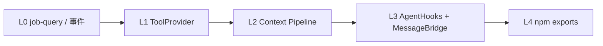
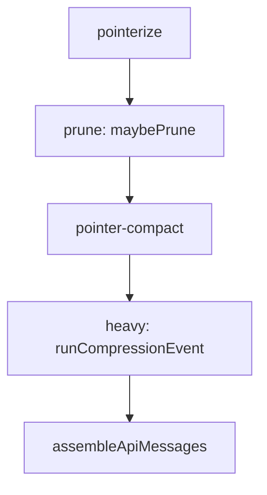

# minimal-agent-ts 统一路线图

> **版本**: 2026-07-12  
> **定位**: 产品迭代、底座模块化、压测策略、扩展接缝的**单一事实来源**。  
> **原则**: 产品 PR 可交付；底座改造**按接缝小步**、不阻塞主线。  
> **验证**: 以本文件 + `npm test`（当前 **372** 用例）为准。

---

## 1. 文档索引（分散 SPEC 归档）

| 文档 | 职责 | 与本路线图关系 |
|------|------|----------------|
| [ROADMAP.md](../ROADMAP.md) | 根目录简表 + 变更日志 | 指向本文；保留轨 A–G 缩写 |
| [README.md](../README.md) | 代码导读、环境变量 | 能力 Phase 表；链接本文 |
| [QUICKSTART.md](../QUICKSTART.md) | 5 分钟上手 | 命令示例；MCP transport |
| [SPEC_CONTEXT_MANAGEMENT.md](../SPEC_CONTEXT_MANAGEMENT.md) | 上下文冷热分离、pointerize、recall | Phase 1–2 设计权威 |
| [SPEC_LLM_ROUTER.md](../SPEC_LLM_ROUTER.md) | 轨 G：api_profiles、fallback、reasoning | G2–G4 ✅；G5 待做 |
| [SPEC_TOOLS.md](../SPEC_TOOLS.md) | web_search / LSP / 文档转换 / Office | 产品轨 Wave 2+ |
| [SPEC_TUI.md](../SPEC_TUI.md) | TUI v0.1 规范 | pi 嫁接细节见轨 A |
| [docs/BRANCH_PLAN_TUI_EXPERIENCE.md](./BRANCH_PLAN_TUI_EXPERIENCE.md) | 嫁接前权限/handoff 记录稿 | **M1–M5 已落地**；M6–M7 见 §3 |
| [docs/BRANCH_PLAN_HOSPITAL_DEVICE_ASSISTANT.md](./BRANCH_PLAN_HOSPITAL_DEVICE_ASSISTANT.md) | 医院设备 fork 草案 | 独立分支；JIT 权限可复用 |
| [agent.mcp.example.json](../agent.mcp.example.json) | MCP 配置示例 | stdio / streamable-http / sse |

**维护约定**: 新里程碑写入本文 §2–§6；子 SPEC 只写**接口/验收细节**；根 `ROADMAP.md` 只追加版本行，避免双份规划漂移。

---

## 2. 当前状态快照（2026-07-12）

### 2.1 已完成（核心底座）

| 能力 | 说明 |
|------|------|
| Phase 1–2 | session、TaskSummary、冷存、pointerize、prune、recall |
| Phase 4–6 | 并行 tool、流式、MCP/Skills、workflow |
| 轨 D/E | `spawn_agent`、`spawn_background`、`code_review` 后台 job |
| 轨 A（基础） | pi-tui、`--json-events` |
| 轨 F | `Agent.md`、`/memory`（`.agent/memory/`）、ZVEC **已硬删** |
| 轨 G（主体） | `api_profiles`、fallback、reasoning、TUI `/profile` `/model` `/reasoning` |
| MCP | stdio + **streamable-http** + legacy **sse**（`mcp-transport.ts`） |
| 权限 | `PermissionGate` JIT、`/approve`、`workflow` checkpoint |
| 交接 | `/brief`（原 `/handoff` 别名已移除） |

### 2.2 仍欠项（按优先级）

| 优先级 | 轨 | 内容 |
|:------:|-----|------|
| **P0 产品** | 产品 | ~~TUI `/jobs`、job-query~~ ✅；~~`web_search` v1+v1.5~~ ✅ |
| **P1 产品** | 产品 | ~~`/spawns` 实装、TUI `turn_io`~~ ✅；pi overlay 统一（按需） |
| **P1 压测** | B | 高压场景 harness（§5）；填压测表 |
| **P1 底座** | 底座 | ToolProvider 拆分、context pipeline、**MessageBridge hook**（§6） |
| **P2** | G5 | Anthropic 显式缓存 `anthropic_breakpoints` |
| **P2** | A/E | workflow if/else（M6）、TUI jobs 状态条抛光 |
| **P3** | C | Rust 内核（profiling 证明需要后再议） |
| **按需** | SPEC_TOOLS | lsp_query、convert_document、office_* |

---

## 3. 产品轨（优先）

```text
Wave 1   /jobs TUI + job-query 层 + RuntimeEvent
    ↓
Wave 2   web_search（SPEC_TOOLS #1）
    ↓
Wave 3   /spawns、turn_io TUI、pi overlay 统一
```

### M-Prod-1：TUI Jobs（✅ 2026-07-12）

| 交付 | 说明 |
|------|------|
| `/jobs` | pi `SelectList` 列表；Enter → status overlay；`t` → events |
| `/jobs status\|tail <id>` | 分页 overlay（meta / events） |
| `src/spawn/job-query.ts` | 查询/格式化层；`job-cli.ts` 复用 |
| 事件 | `job_list` / `job_status`（`--json-events`） |
| 状态条 | `jobs:N running` 于 TUI `printStatus` |

**约束**: TUI 只调 `AgentRuntime` 或 job-query；不穿透 `agent.ts`。

### M-Prod-2：`web_search`（✅ 2026-07-12）

见 **[SPEC_TOOLS.md](../SPEC_TOOLS.md)** §3（v0.2）：

- **v1** ✅：`ddgr --json`；权限同 `web_fetch`
- **v1.5** ✅：spill cache 先查 + 单 task 外搜 budget
- **v2**（可选）：`backend: searxng` 或 MCP HTTP 外置

### M-Prod-3：体验抛光（✅ 2026-07-12）

| 交付 | 说明 |
|------|------|
| `/spawns` | pi `SelectList` 列表注册 preset + 未注册 `agents/*.md`；Enter/`i` → 详情 overlay |
| `src/spawn/preset-query.ts` | `buildSpawnPresetEntries` / `listOrphanAgentFiles` / 格式化 |
| `turn_io` TUI | `ACTION_IO_METRICS=1` 时 chat meta 显示 `turn_io` / `action_flush`；状态条 `io:T…` |
| 按需 | workflow checkpoint / 权限 统一 pi `SelectList`（jobs 已统一） |

### BRANCH_PLAN 里程碑对照

| 里程碑 | 状态 |
|--------|------|
| M1 权限 + resume + workflow checkpoint | ✅ |
| M2 `/approve` + `spawn_policy` | ✅ |
| M3 `/brief` + 压缩疲劳 | ✅（slash 更名） |
| M4 workflow handback | ✅ |
| M5 api_profiles | ✅（轨 G） |
| M6 workflow if/else | ❌ |
| M7 pi 嫁接 P0′ | 部分；P1′–P3′ 随 M-Prod 推进 |

---

## 4. 底座轨（长期、模块化）

**不与产品抢主线**；每个 PR 只动一个接缝，`npm test` 全绿。



### L0 — 查询与事件接缝

- M-Prod-1 顺带完成 `job-query.ts`
- 为 spawn 状态变更预留 `onJobStateChange`（可先 polling）

### L1 — ToolRegistry → Provider（✅ 2026-07-12）

```
ToolRegistry（编排）
  ├── BuiltinToolProvider
  ├── CliToolProvider（web_search）
  ├── SkillsToolProvider
  ├── SpawnToolProvider
  └── McpToolProvider
```

迁移顺序：**MCP → spawn → skills → cli → builtin**；接口 `load()` + `getDefinitions()` + `execute()`。  
`context-budget.ts` / `context-policy.ts` 等旧 import 路径保留。

### L2 — context-policy → Pipeline（✅ L2-0～L2-6 完成）

**现状**（~776 行）：`context-budget.ts`（budget/resume）、`context-policy.ts`（prune/compact/heavy/assemble）、`pointerize.ts`（turn 末指针化）。`agent.ts` 的 `applyTurnEndCompression` 已委托 `runTurnEndPipeline`（L2-0）。

**目标目录**：

```text
src/context/
  types.ts              # TurnContext, TurnPipelineResult
  pipeline.ts           # runTurnEndPipeline, runResumePipeline（后）
  pointerize-stage.ts   # stage 0 → pointerize.materializePriorTurnTools
  budget.ts             # ← context-budget.ts
  estimate.ts           # protectedIndices, estimatePruneSavings
  prune.ts              # maybePrune, applyPrune, releaseCompacted*
  pointer-compact.ts    # maybeCompactPointerCards
  heavy-compression.ts  # runCompressionEvent, notice/summary/replay
  assemble.ts           # assembleApiMessages, repairToolCallPairs

context-budget.ts / context-policy.ts  → re-export wrapper（行为不变）
```

**Turn-end 数据流**：



**Resume 路径**（与 turn-end 并列，L2-1 起收编）：`shouldCompress` + `buildContext` → `runResumePipeline`。

| PR | 内容 | 状态 |
|----|------|------|
| L2-0 | `pipeline.ts` 脚手架 + `agent.ts` 委托 + `tests/context-pipeline.test.ts` | ✅ |
| L2-1 | 迁 `budget.ts` | ✅ |
| L2-2 | 迁 `assemble.ts` | ✅ |
| L2-3 | 迁 `prune.ts` | ✅ |
| L2-4 | 迁 `pointer-compact.ts` | ✅ |
| L2-5 | 迁 `heavy-compression.ts` + `estimate.ts`；`context-policy.ts` 瘦成 wrapper | ✅ |
| L2-6 | `TurnPipelineResult` 观测 + 删死代码 | ✅ |

**原则**：每 PR 只动一个 stage；不改 prune 门槛与 compression 比例；420+ tests 全绿。

**非目标（L2）**：子 agent 独立 context 策略、MessageBridge（L3）、新 RuntimeEvent（可 L2+1 小 PR）。

### L3 — AgentHooks + MessageBridge（含 IM 预留）

见 §6。

### L4 — 库化（产品形态稳定后）

- `package.json` `exports`、`src/index.ts`
- `agent.schema.json`
- `examples/custom-tool/`

---

## 5. 压测策略（轨 B 修订）

### 5.1 为何目前测不到拐点

| 因素 | 说明 |
|------|------|
| API 并发限制 | 多 spawn 同时打 LLM 时，瓶颈在厂商 rate limit，掩盖本地 IO/内存拐点 |
| 子 Agent 工具集偏窄 | 预设多为只读或短任务，`max_turns` 默认 15，并行度不足以压满写盘队列 |
| 异步 IO 已落地 | 2026-07 主观卡顿部分已缓解；需**更高压**场景复测 |

压测表（根 `ROADMAP.md` §轨 B）仍保留；**填表前提**改为先具备 §5.2 harness。

### 5.2 高压 harness（规划，产品/压测交叉）

目标场景：**主 Agent 委派多个 `spawn_background` 子 Agent 并行开发**（多文件读写 + 可选 shell）。

| 项 | 现状 | 规划 |
|----|------|------|
| 子 Agent `max_turns` | 各 preset **50**（`max_turns_cap` **80**） | ✅ 统一 50 |
| 子 Agent shell | preset 含 `run_shell` 时继承父级 `allowShell` + JIT gate + C5 policy | ✅；见 §5.3 |
| 并行度 | `max_parallel` 默认 **3** | 压测可多 profile 分散限流 |
| 工具集 | **`dev-worker` / `skeleton-reader` / `code-review-*`** 全量编码工具；web/HN 仍窄 | 见 [SPEC_TOOLS.md](../SPEC_TOOLS.md) §7 |
| 观测 | `ACTION_IO_METRICS=1`、`--json-events` | 加 **per-job** `turn_io` 汇总；TUI `/jobs` 展示 |

**压测脚本草案**（文档级，实现随 M-Prod-1 / harness PR）：

```bash
# 多后台 dev worker，注意 API 配额
ACTION_IO_METRICS=1 npm start -- --json-events --allow-shell --cwd /path/to/sandbox \
  "并行 spawn_background 3 个 dev-worker，分别实现模块 A/B/C …"
```

### 5.3 子 Agent 权限控制 shell（可行性）

**结论：可行，已有 80% 接缝，缺「策略层」细化。**

| 层 | 已有 | 待补（可选 PR） |
|----|------|-----------------|
| 能力继承 | 子 spawn 继承父 `allowShell` / `permissionGate`；preset 需 shell 时走 JIT | — |
| 预设工具 | `agent.json` `spawn_presets[].tools` 可列 `run_shell` | stress preset 文档化 |
| 深度限制 | `MAX_SPAWN_DEPTH = 2`；子 Agent 不能再 spawn | 压测用 `spawn_background` 绕过交互 spawn 深度 |
| 命令约束 | `run_shell` 全 cwd 内 | ✅ **`spawn_shell_policy`**（C5）：`allowed_prefixes`、`deny_patterns`、timeout default/cap；仅 `spawnDepth>0` |
| 后台 job | `jobOnStep` 转发 `AgentStepEvent` 到 `events.jsonl` | 与 MessageBridge 共用 sink |

**不建议**：给子 Agent 无 gate 的 shell；高压场景应 **sandbox cwd + preset 白名单 + 父级先 `/approve session shell`**。

### 5.4 轨 B 验收（修订）

- [ ] 在 §5.2 harness 下采集 turn P50/P95、RSS、`action_flush` 队列深度
- [ ] 区分 **API 限流** vs **本地 IO**（多 profile fallback / 错峰 spawn）
- [ ] 无拐点则 **保持 TS**，不启动轨 C

---

## 6. Hooks 与 MessageBridge（IM 预留）

> 暂不实现飞书 / Discord / Telegram；只定**类型与转发接缝**，避免日后穿透 `agent.ts`。

### 6.1 设计目标

- 外部通道（未来）只实现 `MessageSink`，不碰 ReAct 语义
- 与现有 `RuntimeEvent` / `--json-events` **并存**：events 偏结构化遥测；bridge 偏**会话消息流**

### 6.2 消息类型（草案）

```typescript
/** 会话内一条可转发消息（user / assistant / tool 摘要） */
interface SessionMessage {
  session_id: string;
  turn: number;
  role: 'user' | 'assistant' | 'tool' | 'system_notice';
  /** 增量或全文；由 emit 方标明 */
  delta?: string;
  content?: string;
  tool_name?: string;
  call_id?: string;
  /** 便于 IM 侧 threading */
  task_id?: string;
  timestamp: number;
}

interface MessageBridge {
  /** 注册 sink；可多路（日志 + 未来 IM） */
  addSink(sink: MessageSink): void;
  emit(msg: SessionMessage): void;
}

interface MessageSink {
  readonly name: string;
  /** 返回 false 表示该 sink 禁用，不阻塞主循环 */
  onMessage(msg: SessionMessage): void | Promise<void>;
}
```

### 6.3 接线点（实现顺序）

| 阶段 | 位置 | 转发内容 |
|------|------|----------|
| H1 | `runner.ts` `submitTask` | 用户 task 全文 |
| H2 | `agent.ts` `runAgent` | `token` 累积为 assistant delta；`final` 定稿 |
| H3 | `agent.ts` tool 完成 | tool 结果摘要（pointerize 后或 preview） |
| H4 | `spawn/job-runner.ts` | 子 job 经 `jobOnStep` 转为 `SessionMessage`（`session_id` = spawn session） |
| H5 | `AgentRuntime` 构造 | 可选 `messageBridge?: MessageBridge`；默认 no-op |

**与 `--json-events` 关系**:

- `AgentStepEvent` 保留（机器可读、完整字段）
- `SessionMessage` 面向**人类可读流**（IM 气泡、移动端）
- TUI presenter 未来可订阅 bridge，与 pi 组件解耦

### 6.4 明确不做（本阶段）

- OAuth、Bot token、飞书/Discord SDK
- 双向 IM（用户从飞书回消息）— 需另开 `InboundAdapter` spec
- 为 bridge 改 pointerize / compression 规则

---

## 7. 推荐总顺序

```text
现在 ──────────────────────────────────────────────────────────►

[产品]  M-Prod-1 jobs → M-Prod-2 web_search → M-Prod-3 polish
          ‖                    ‖
[底座]  L0 job-query      L1 CliTool 雏形
          ‖
[压测]  5.2 stress preset + dev-worker 文档 → 填压测表
          ‖
[底座]  L1 Provider ✅ → L2 context pipeline（L2-0 ✅）→ L3 MessageBridge H1–H5
          ‖
[可选]  G5 Anthropic cache / M6 workflow if-else / L4 npm exports
```

---

## 8. 版本记录

| 日期 | 说明 |
|------|------|
| 2026-07-12 | L2-6 统一 compression step 事件；`runTurnEndCompression`；删 `applyTurnEndCompression` |
| 2026-07-12 | L2-5 `estimate.ts` + `heavy-compression.ts`；`context-policy` 纯 re-export wrapper |
| 2026-07-12 | L2-4 `context/pointer-compact.ts` 迁入；`context-policy` re-export |
| 2026-07-12 | L2-3 `context/prune.ts` 迁入；`protectedIndices`/`isImmune` 暂 export 供 pointer-compact |
| 2026-07-12 | L2-2 `context/assemble.ts` 迁入；`context-policy` re-export |
| 2026-07-12 | L2-1 `context/budget.ts` 迁入；`context-budget.ts` re-export |
| 2026-07-12 | L2-0 context pipeline 脚手架；L1 ToolProvider 五 provider 完成 |
| 2026-07-12 | 统一路线图初版：产品/底座双轨、压测 harness、MessageBridge、文档索引 |
| 2026-07-12 | MCP HTTP（streamable-http + sse）合入 `9bc7425` |
| 2026-07-06 | 轨 F、pi-tui、ZVEC opt-out |
| 2026-07-10 | 轨 G SPEC；api_profiles 主线 |

---

*子 SPEC 冲突时以本文 §2 快照 + `npm test` 为准；接口细节以对应 SPEC 为准。*